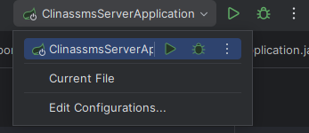
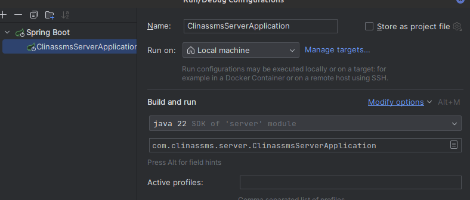
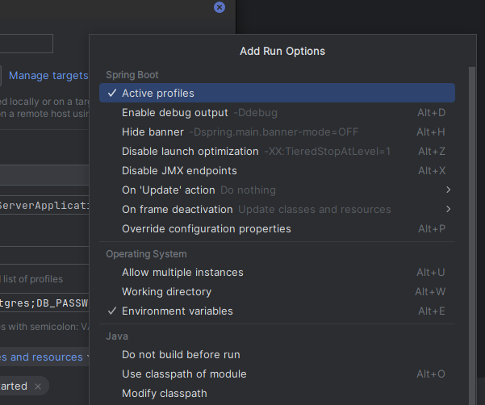

# ClinASSMS
ClinASSMS is an appointment scheduling system integrated with service management, aimed at facilitating remote scheduling and reducing waiting latency caused by poor queue organization. 

<br>

## _Configure Environments Variables for IntelliJ IDEA_
Para que o '`jdbc`' possa emcontrar se conectar com o banco de dados é necessario configurar os dados corretamete para o acesso. 

Para isso especificamos no codigo essa informações utilizando environments variables para que dados senciveis não sejam expostos publicamente no repositio. Assim declaramos a seguinte estrutura no arquivo application.properties:
```Java
spring.application.name=Clinassms Server
spring.datasource.url=${DB_URL}
spring.datasource.username=${DB_USER}
spring.datasource.password=${DB_PASSWORD}
```

Após a configuração em código é necessario declarar os valores que devem ser atribudos as envaroments variables, de acordo com imagem abaixo acesse `Edit Configuration...`



Click em `Modify options`



Selecione  `Environmets variables`



E no campo `Environments variables` declare os valores de cada variavel expecificada no estrutura de configuração para conectar ao Database. Seguindo o seguinte modelo:
```DB_URL
DB_USER=my_user; DB_PASSWORD=my_password; 
```
Por fim clica em Aplay